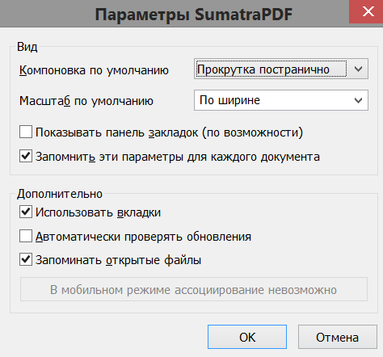

[SumatraPDF-Plus: Extended version of popular SumatraPDF](https://github.com/Krot66/SumatraPDF-Plus)

[SumatraPDF Plus (forum.ru-board.com)](http://forum.ru-board.com/topic.cgi?forum=5&topic=50129#1)

**SumatraPDF Plus**

Портативная версия SumatraPDF со множеством удобств и доработок, включающая 32- и 64-битную версию программы, а также механизм файловых ассоциаций.

**Поддерживаемые расширения**: pdf, djv, djvu, fb2, fb2z, fb2.zip, epub, xps, oxps, mobi,  cb7, cb7z, cbr, cbz, cbt, ps, pdb, chm

**Операционная система:** Windows 7+ (отдельная версия для WinXP)

***Настоящий файл открывается в приложении по F1!***

### Возможности

- Портативная версия, включающая 32- и 64-битные версии программы

- Возможность ассоциации файлов через графический интерфейс с возможностью выбора расширений с разными иконками типов, которые можно менять самостоятельно

- Интеграция в контекстное меню файлов

- Настройка внешних программ просмотра и редактирования файлов простым перетаскиванием их ярлыков  или создания батников с последующим вызовом их из меню

- Возможность быстрого создания цитат из файла или заметок к нему в одноименном файле в папке Notes в каталоге программы

- Программа идет с нормальной и ночной темой, переключать которые можно по горячей клавише или из иконки в трее. Быстрое создание профилей и переключение между ними

- Панель-индикатор страниц, позволяющая скрыть панель инструментов, на которой отображается время в полноэкранном режиме

- Быстрое открытие закладок и избранного кликом по левой границе окна

- Создание избранного с цитатами из выделенного текста

- Сходным способом можно переходить в полноэкранный режим и вызывать окно свойств документа

- Быстрое создание дублированной вкладки документа, что удобно для чтения примечаний в pdf и djvu

  Файловые операции (по отношению к открытому документу):

  - Быстрое  переименование файла из выделенного текста
  - Копирование в буфер обмена для последующей вставки в проводнике или файловом менеджере
  - Копирование пути к файлу
  - Создание ярлыка на рабочем столе
  - Копирование на рабочий стол
  - Копирование в папку _Read, находящуюся в корне диска, с которого запущена программа
  - Удаление в корзину с подтверждением

- Возможнсть последовательного просмотра файлов папки без помощи файлового менеджера, в т.ч. открывая файлы в новых вкладках

### Интеграция в систему

Для ассоциации файлов запустить файл FileAssociation.exe от имени администратора, выбрать расширения и подтвердить ассоциацию. Иконки файлов находятся в папке icons, подписанные соответствующими расширениями. В случае отсутствия иконки расширения в качестве источника используется исполняемый файл. Файлы chm не ассоциируются.

Чтобы добавить SumatraPDF в контекстное меню файлов можно использовать батник ContextMenu-Add.bat. Батник ContextMenu-Remove.bat удаляет контекстное меню.

### Быстрое открытие текущего документа в другом приложении ###

SumatraPDF дает возможность прописывать такие альтернативные программы в файл настроек SumatraPDF-settings.txt (они потом появляются в меню Файл - Открыть с помощью...), но это долго, хлопотно, от чего этим мало кто пользуется. Здесь для этих целей используется папка Shortcuts в каталоге программы, куда можно закинуть ярлыки интересующих программ или батники, если это нужно для портативности. После добавления нужно перезапустить Суматру - теперь документ можно открыть в другом приложении из меню иконки в трее или вызвав меню по сочетанию Shift+ПКМ. SumatraPDF сразу же показывает измененный документ, если он редактировался.

### Доработки интерфейса

#### Максимизация при запуске

Большая часть нижеописанных удобств рассчитаны на использование программы собственно для чтения текстов с максимизированным или развернутым на полный экран окном. Сама программа в принципе запоминает последнее состояние окна, но можно заставить ее делать это постоянно создав в ее каталоге пустой текстовый файл max.txt.

#### Панель-индикатор текущей страницы ####

При открытии файла в нижнем левом углу отображается индикатор страниц. При запуске он ненадолго разворачивается, показывает имя файла и его размер. Развернуть его можно в любой момент простым нажатием или по сочетанию Ctrl+Space. Правый клик работает как команда "Назад" после перехода по сноске или закладке файла (сделано для планшетных компьютеров, где это проблема). Средняя кнопка при нажатии на индикатор выводит окно "Перейти на страницу". В полноэкранном режиме на нем выводится текущее время. Еще в правом верхнем углу на нем выводится цифра, соответствующая номеру текущего профиля (смотри ниже).

Панель инструментов SumatraPDF есть излишество, только занимающее место на экране. Скрыть/показать панель инструментов можно в любой момент клинув правой кнопкой мыши у верхнего края экрана или из меню "Вид" программы.

#### Горячие клавиши ####

- Если окно максимизировано или развернуто на весь экран, левый клик мышью у левого края экрана открывает окно закладок файла, если они есть. (Alt+Up работает везде)
- Правый клик там же открывает окно избранного (Alt+Down работает везде)
- Средний клик там же добавляет текущую позицию к избранному. Если выделен текст, он будет автоматически добавлен в скобках к названию избранного.
- Средний клик мышью у правого края экрана переводит приложение в полноэкранный режим.
- Правый клик мышью там же открывает окно свойств документа
- Средний у верхнего края экрана (или сочетание Ctrl+Shift+O) вызывает увеличенное окно открытия файла с пордсветкой текущего и детальным видом папки
- Правый клик там же  скрывает и выводит вновь панель инструментов
- Сочетание Shif+Tab открывает документ в еще одной вкладке, что удобно при необходимости частого просмотра примечаний в конце pdf или djvu файла (можно сделать из иконки в трее)

#### Несколько примочек браузерного образца (Rocket Gestures) ####

- Если зажать правую кнопку мыши и прокрутить колесико, будет происходить циклическое переключение вкладок.
- Последовательное нажатие правой и левой кнопок мыши работает как переход назад, а последовательное нажатие  левой и правой кнопок - вперед.

### Файловые операции ###

Возможности, большей частью имеющиеся и в меню иконки в трее:

- Быстрое переименование открытого файла из выделенного текста. Выделяем, жмем Shift+F2 и получаем окно переименвания с уже подставленным подготовленным текстом. Работает, если нет защиты от копирования и проблем с кодировкой файла.
- Ctrl+Shift+C - копирование открытого файла в буфер обмена для последующей вставки в файловом менеджере
- Ctrl+Shift+P - копирование полного пути к нему 
- Создание ярлыка открытого файла на рабочем столе по сочетанию Ctrl+Shift+Z.
- Сохранение копии открытого файла на рабочий стол по Ctrl+Shift+D.
- Ctrl+Shift+S - сохранение копии открытого файла  в папку "_Read", находящей в корне раздела, с которого запущена программа. Это удобно при запуске с флэшки для сбора на нее интересущих файлов.
- Удаление открытого файла в корзину с подтверждением по Ctrl+Del или Ctrl+серый Del. При этом будет открыт следующий файл папки, если он есть.

### Последовательный просмотр множества файлов ###

Программа позволяет перемещаться по файлам без помощи файлового менеджера, последовательно обходя имеющиеся в папке файлы поддерживаемых ею расширений (последовательность выстроена как при сортировке по расширениям в проводнике). В сочетании с файловыми возможностями программы это позволяет быстро наводить порядок в больших количествах файлов.

-  Сочетание Alt+PgDn закрывает настоящий файл и открывает следующий, Alt+PgUp - предыдущий. При достижении конца или начала выводится тултип.
-  Alt+Home - первый файл папки, Alt+End - последний.
-  Можно не закрывать предыдущий файл, а открывть новый в новой вкладке. Для этого можно использовать сочетания Ctrl+Alt+PgDn и Ctrl+Alt+PgUp.
-  Наконец удаление файлов по Ctrl+Del это тоже своего рода способ перемещения при разгребании завалов

### Создание цитат и заметок к файлам

Возможно из меню иконки в трее или по сочетанию Alt+S. Если в этот момент был выделен текст, он попадает в окно редактора, иначе открывается поле ввода заметки.

Заметки хранятся в папке Notes в текстовых файлах, одноименных с файлами книг. Заголовок заметки содержит текущую позицию и время создания в обрамлении "###" (сделано для простоты удаления).

### Многопрофильный режим работы программы ###

Множество настроек программы прописывается руками в текстовом конфигурационном файле, и менять их раз от разу обременительно. В SumatraPDF Plus возможно сохранять эти настройки в отдельных профилях и переключаться между ними по горячим клавишам или из меню иконки в трее. Программа идет с двумя профилями ("дневная" и "ночная" темы), но можно использовать профили для адаптации к различным размерам экрана, настроек печати и пр..

По умолчанию портативная SumatraPDF сохраняет в файле SumatraPDF-settings.txt. Здесь файлы определенным образом тасуются, так что профили сохраняются в папке Data. Если нажать сочетание Alt+N,  будет выведено сообщение о создании нового профиля с соответствующим номером и горячей клавишей. В папке Data будет появляться набор файлов вида


```autohotkey
SumatraPDF-settings_1.txt
SumatraPDF-settings_2.txt
SumatraPDF-settings_3.txt
.............
```

где каждый из профилей активируется горячей клавишей Alt+цифра в конце имени. Номер профиля выводится в правом верхнем углу панели страниц, последний профиль восстанавливается при следующем запуске. Общая часть настроек в виде состояния открытых файлов и избранного переносится при переключении профиля из одного конфигурационного файла в другой.

**Важно:**

- Новый профиль создается на основе текущего
- Не следует напрямую редактировать профили в папке Data, когда программа запущена и активирован данный профиль - изменения могут быть потеряны при выходе. Используйте пункт меню Настройки - Расширенные настройки или выйдите из программы.
- Суматра не всегда сразу применяет измененные настройки при таком редактировании - для этого как минимум необходимо закрытие редактора. Для принудительного обновления следует использовать клавишу "R" или горячую клавишу профиля.
- Удаление профиля производится из папки Data когда он неактивен

### Открытие списков файлов и интеграция в файловые менеджеры

Программа позволяет открывать одним кликом множество файлов в разных вкладках, выделенных в файловом менеджере или проводнике. 

В случае проводника можно просто добавить ярлык программы в меню **Отправить** (%USERPROFILE%\SendTo), и пользоваться этим почти где угодно.

В FAR это возможно командой


```autohotkey
<Путь к SumatraPDF.exe> [параметры] !&
```

Маска для внутренней ассоциации


```autohotkey
*.djv*;*.pdf;*.xps;*.oxps;*.epub;*.*fb2;*.fb2z;*.fb2.zip;*.pdb;*.mobi;*.cb7*;*.cbr;*.cbz;*.cbt;*.ps
```

В Total Commander


```autohotkey
Команда: <Путь к SumatraPDF.exe>
Параметры: [параметры] %S
Путь запуска: пусто
```

В Double Commander


```autohotkey
Команда: <Путь к SumatraPDF.exe>
Параметры: [параметры] %f
Путь запуска: пусто
```

### О настройках программы ###

Графические настройки программы (Меню - Настройки - Параметры) достаточно бедны. Рекомендуются такие значения



Вопрос использования вкладок зависит от пользователя, но лучше пользоваться ими для некоторых дополнительных возможностей. Получить имя файла теперь можно нажатием на панель страниц не всматриваясь в надписи вкладки. 

#### Текстовые настройки SumatraPDF ####

Остальные настройки имеют текстовый вид и доступ к ним открывается через пункт "Расширенные настройки". Программа идет с преднастроенным файлом  (который можно всегда восстановить удалив файл Bin\SumatraPDF-settings.txt), но некоторе понимание все же необходимо. 
Для того, чтобы вместе с запущенным файлом не открывлись последние открытые, следует поставить


```
RestoreSession = false
```

Чтобы можно было пользоваться файловыми операциями, должно стоять отображение полного пути в заголовке программы или на вкладке


```
FullPathInTitle = true
```

В EbooksUI должно быть 


```
UseFixedPageUI=true
```

иначе не будет отображаться индикатор страниц. Использование книжного двустраничного представления - чистый мазохизм и порча глаз, так что это небольшая потеря. 

Здесь же следует настроить размер текста


```
FontName = Georgia
FontSize = 12.5
```

Там же есть настройки цветов шрифта и фона в формате html. Шрифт не должен быть совершенно черным, а фон совершенно белым - для зрения это важно.


```
TextColor = #5f4b32
BackgroundColor = #fbf0d9
```

Стоит также поменять цвет выделения с желтого на что-нибудь более спокойное


```
SelectionColor = #115fe5
```

Теперь о масштабировании документов. В файле задана последовательность ZoomLevels, по которым документ масштабируется клавишами "+" и "-". Вместо этого лучше задать 


```
ZoomIncrement = 3
```

что сразу же сделает масштабирование плавнее, чем во множестве других программ.

#### Официальная справка по параметрам ####

Детальное описание настроек здесь: [Customizing SumatraPDF 3.2](https://www.sumatrapdfreader.org/settings.html  "03.03.2019  21:40")

### Горячие клавиши SumatraPDF ###

| Сочетание клавиш    | Действие                                                     |
| :------------------ | ------------------------------------------------------------ |
| PgDn, PgUp          | Страница вверх - вниз                                        |
| Home, End           | Первая и последняя страница                                  |
| Left, Right         | Постраничная прокрутка (если нет горизонтальной полосы прокрутки - иначе перемещение) |
| Shift+Колесо        | Поэкранная прокрутка                                         |
| Space               | На экран вниз                                                |
| J, K                | Построчная прокрутка вверх-вниз                              |
| N, P                | Следующий-предыдущий экран                                   |
| Alt+Left, Alt+Right | Переходы назад и вперед                                      |
| Ctrl+G              | Переход к странице                                           |
| B                   | Перелистывание страниц в двустраничном режиме                |
| +, - (в т.ч. серый) | Увеличение-уменьшение масштаба страниц                       |
| Ctrl+Колесо         | То же                                                        |
| Z                   | Переключение режимов масштабирования                         |
| С                   | Переключение режима прокрутки                                |
| F11                 | Полноэкранный режим                                          |
| Esc                 | Выход из полноэкранного режима (из программы - при EscToExit = true в настройках) |
| F12                 | Закладки документа                                           |
| Ctrl+O              | Открыть файл                                                 |
| Ctrl+W              | Закрыть файл                                                 |
| Ctrl+S              | Сохранить как                                                |
| Ctrl+P              | Распечатать                                                  |
| Ctrl+F              | Поиск                                                        |
| F3, Shift+F3        | Следующее/предыдущее найденное                               |
| Ctrl+ЛКМ            | Выделение текста и изображений прямоугольником               |
| Ctrl+Q              | Выход                                                        |

### FAQ ###

В. Как сбросить настройки программы на первоначальные?
O. Удалить папку Data настройки будут восстановлены из папки Defaults.

В. Как уменьшить размер сборки?
O. Удалить файл Bin\SumatraPDFx64.exe. Он необходим только для oчень больших файлов. Можно удалить файлы UnRAR.dll, если они там есть и вас не интересуют файлы Comic Book.

В. Как обновить программу до новой версии или тестового билда?
O. Заменить соответствующие файлы в папке Bin на файлы портативной версии программы.

В. Как передать внешнему приложению (из папки Shortcuts) параметры командной строки, если это необходимо?
O. Прописать их в свойствах добавляемого ярлыка.

В. Как поменять иконки для ассоциируемых файлов?
О. Заменить их в папке icons для соответствующих расширений. Желательно наличие в них стандартных размеров изображений и их битности.

В. После ассоциации файлов иконки не обновляются...
О. Почистить кэш иконок, например, [Icon Cache Cleaner](https://soft.softodrom.ru/ap/Icon-Cache-Cleaner-p19026  "14.02.2019  10:59"). Часто достаточно перезагрузки или выхода из системы.

В. Суматра часто забывает режим прокрутки или отображения страниц, что с убранной панелью инструментов причиняет невыносимые страдания. Что с этим делать?
O. Жить. И жать клавиши C и Z до победного конца.

